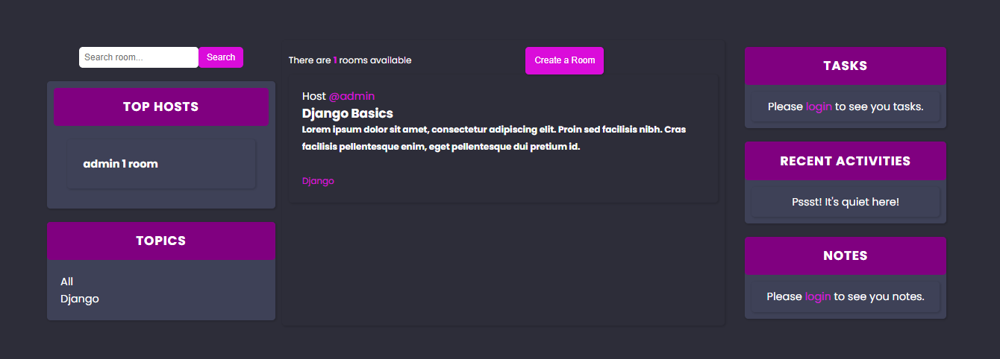

# StudyHall



StudyHall is a web application that allows users to create rooms for different study topics, chat with other members, and manage their study tasks. It provides a platform for collaborative studying and task management.

## Features
- Room Creation: Users can create rooms for different study topics, providing a description and selecting relevant tags.
- Room Chat: Members of a room can chat with each other in real-time, facilitating discussions and collaboration.
- Task Management: Users can create, update, and delete tasks related to their study topics, keeping track of their study progress.
- Topic Management: Users can add new topics, edit existing topics, and view all topics available in the application.
## Installation
1. Clone the repository: git clone https://github.com/TKaburu/StudyHall.git
2. Create a virtual environment and activate it
3. Install dependencies: ```pip install -r requirements.txt```
4. create a new secrete key
5. Apply database migrations: ```python manage.py migrate```
6. Run the development server: ```python manage.py runserver```
## Usage
1. Create a superuser to access the admin interface: ```python manage.py createsuperuser```
2. Start the development server: ```python manage.py runserver```
Access the application in your web browser: http://localhost:8000/

## Technologies Used
- Django: Web framework for building the application.

- SQLite: Database used for storing application data.
- HTML and CSS: Frontend technologies for the user interface.
## Contributing
Contributions are welcome! Please fork the repository and submit a pull request with your changes.

## License
This project is licensed under the MIT License - see the LICENSE file for details.


